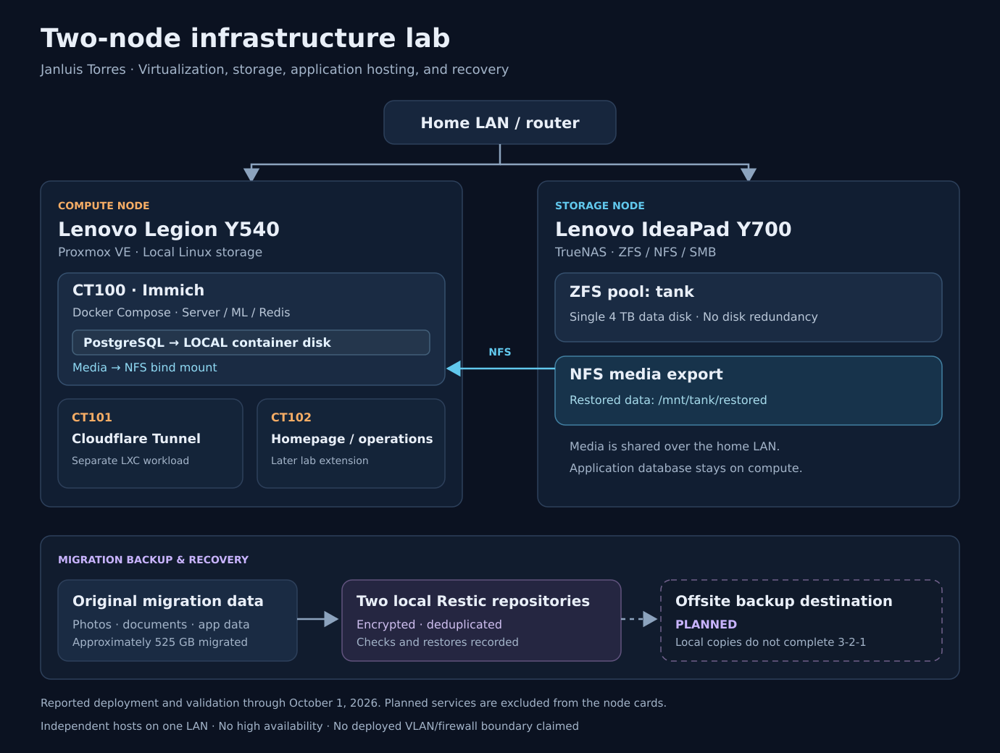

# Two-Node Infrastructure & Security Lab

**Janluis Torres · Linux administration, virtualization, storage, and recovery**

I repurposed two Lenovo laptops into a Proxmox compute host and a dedicated TrueNAS storage server, migrated approximately **525 GB** of existing data, and deployed Immich with Docker Compose inside LXC. This portfolio documents the architecture, recovery decisions, and real failures encountered along the way.

The strongest part of the project is the troubleshooting: PostgreSQL filesystem errors, a four-layer NFS permission problem, Proxmox outages, resource exhaustion, and ZFS integrity investigations.

## Architecture

**Storage path:** TrueNAS ZFS dataset → NFS mount on Proxmox → bind mount in the Immich container. **PostgreSQL stays on local Linux/container storage.**

[Architecture and design decisions](architecture/infrastructure-diagram.md) · [Compute node](proxmox/compute-node.md) · [Storage node](truenas/storage-node.md)

## What I built and verified

| Work | Result | Supporting documentation |
|---|---|---|
| Virtualization and application hosting | Proxmox with LXC; Immich, PostgreSQL, Redis, and machine learning through Docker Compose | [Compute configuration](proxmox/compute-node.md) |
| Storage integration | Single-disk ZFS pool with NFS media storage and local application databases | [Storage design](truenas/storage-node.md) |
| Migration and recovery | Approximately 525 GB migrated; Restic repositories checked and restores tested | [Migration record](documentation/project-overview.md) |
| Backup engineering | Two encrypted local Restic repositories; repository copying and recovery validation | [Backup and recovery](backup/restic-strategy.md) |
| Incident investigation | Logs, permission tests, resource graphs, SMART results, scrubs, and sample file hashes used to diagnose failures | [Incident reports](documentation/incident-postmortems/README.md) |

Cloudflare Tunnel runs in a separate LXC container. A later operations container hosts Homepage and Immich update tooling. On **October 1, 2026**, the recorded Compose output showed the Immich server, PostgreSQL, and machine-learning services healthy, with Redis running; application functionality was confirmed afterward.

## Start with these case studies

- [NFS permissions across TrueNAS, Proxmox, and unprivileged LXC](documentation/incident-postmortems/nfs-permissions.md)
- [ZFS/HDD investigation and recovery evidence](documentation/incident-postmortems/truenas-storage-hdd.md)
- [PostgreSQL filesystem incident during migration](documentation/incident-postmortems/postgresql-corruption.md)
- [Proxmox network lockout and reboot recovery](documentation/incident-postmortems/proxmox-network-lockout.md)

[All incident reports](documentation/incident-postmortems/README.md) · [Screenshots and validation evidence](evidence/README.md) · [Operations runbook](documentation/operations-runbook.md)

## Security and project boundaries

This is a personal lab applying concepts studied for **CompTIA Security+**. Compute/storage separation, encrypted backups, container identity mapping, and credential rotation are documented alongside their limitations.

The storage pool has one data disk; the two hosts do not provide high availability. A broad dataset ACL was used to resolve a lab permission issue and remains a hardening item. The Restic copies are local, so **offsite protection is still planned**.

[Security controls and limitations](security/controls-and-limitations.md)

## Next steps

Nextcloud, VLAN segmentation, OPNsense, WireGuard, centralized logging/SIEM, vulnerability scanning, and an offsite backup destination are **planned**. They are not presented as deployed services.

[Project overview and roadmap](documentation/project-overview.md)
