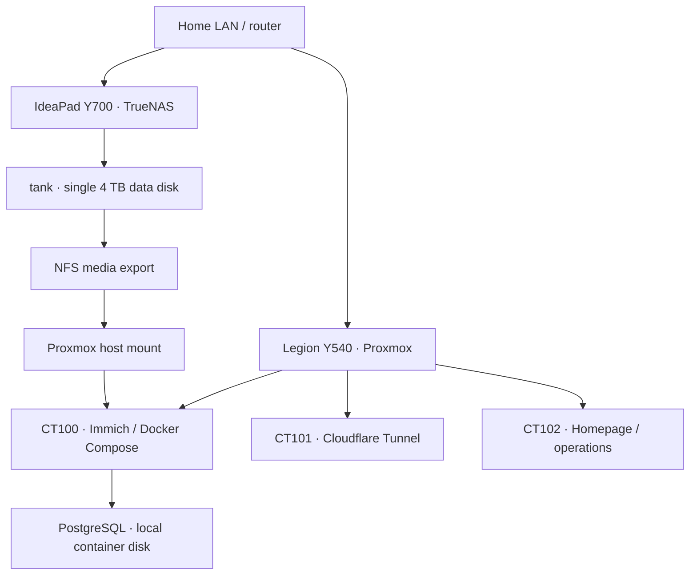

# Architecture and design decisions

[Back to the portfolio](../README.md)

## Deployed baseline

The Legion Y540 runs Proxmox and applications. The IdeaPad Y700 runs TrueNAS and supplies file storage. They are independent hosts on the home LAN, not members of a two-node Proxmox cluster.

Arrows show hosting and storage dependencies. Network access is bidirectional; a storage arrow does not imply that application traffic or database files pass through the NAS.

## Storage mapping

| Layer | Documented location | Purpose |
|---|---|---|
| TrueNAS | `/mnt/tank/restored` | Restored dataset backing the media share |
| Proxmox host | `/mnt/pve/immich-nfs` | NFS storage mount |
| Immich LXC | `/mnt/immich-data` | Bind mount of the host's NFS directory |
| PostgreSQL | Local Linux/container storage | Database data, separate from NFS media |

The checked-in [CT100 resource screenshot](../evidence/proxmox/lxc-immich-resources.png) shows the host/container bind-mount paths. It does not expose the complete Docker volume configuration; the exact database directory is not inferred from that image.

## Design decisions

| Decision | Benefit | Tradeoff |
|---|---|---|
| Separate compute and storage | Independent administration and clearer failure boundaries | Immich still depends on the NAS and LAN for media |
| Keep PostgreSQL on local Linux storage | Avoid the Windows-translated storage path implicated in the migration incident | Database backup must be managed separately from media backup |
| Mount NFS on the host, then bind it into LXC | One storage integration point visible to Proxmox | Host, NFS, dataset, and container identities must agree |
| Use unprivileged LXC identity mapping | Container root maps to a different host identity | NFS ACLs must account for the effective host UID/GID |
| Use independent Restic repositories | Encrypted, deduplicated recovery copies | Two local repositories do not provide an offsite copy |

Physical role separation is not VLAN segmentation or a firewall boundary. The single-disk pool has no redundant data disk from which to reconstruct damaged file contents.

The original `infrastructure-diagram.jpg` is retained as a historical illustration. The SVG and dependency diagram on this page are the maintained architecture reference.

CT102 also runs the Python/systemd operations service. It connects by restricted SSH to `pve`, where the forced update command invokes CT100's Compose workflow through `pct exec 100`, then checks application API health. The permitted path was tested; implementation/validation details are in the [operations-node record](../proxmox/operations-node.md).

See the [current deployment](../documentation/current-state.md), [operations runbook](../documentation/operations-runbook.md), and [security record](../security/controls-and-limitations.md).
