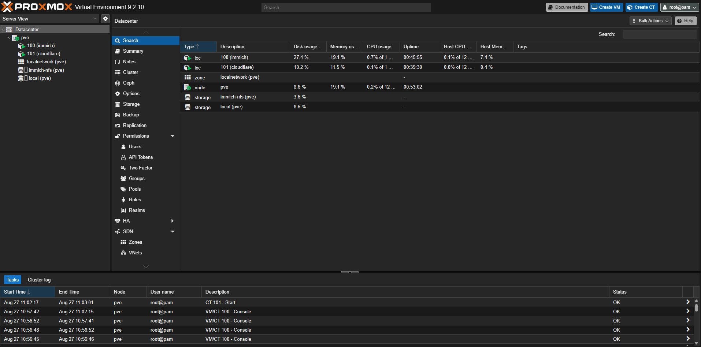
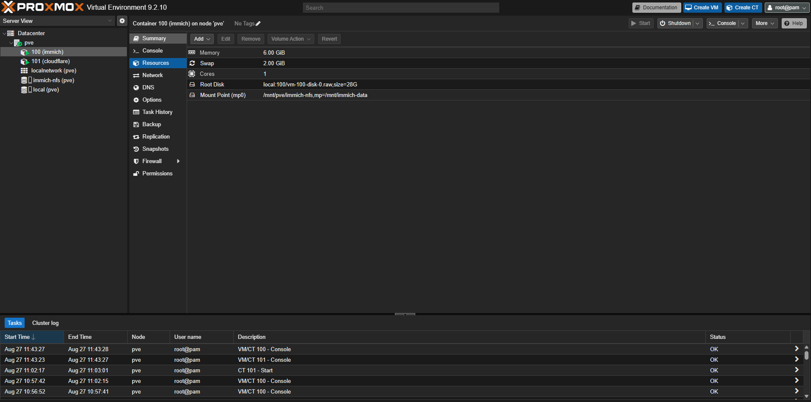
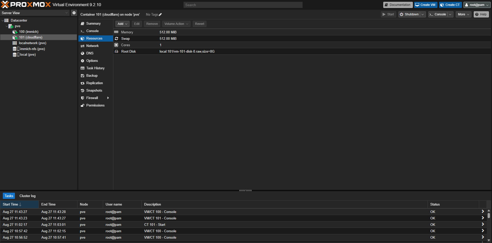
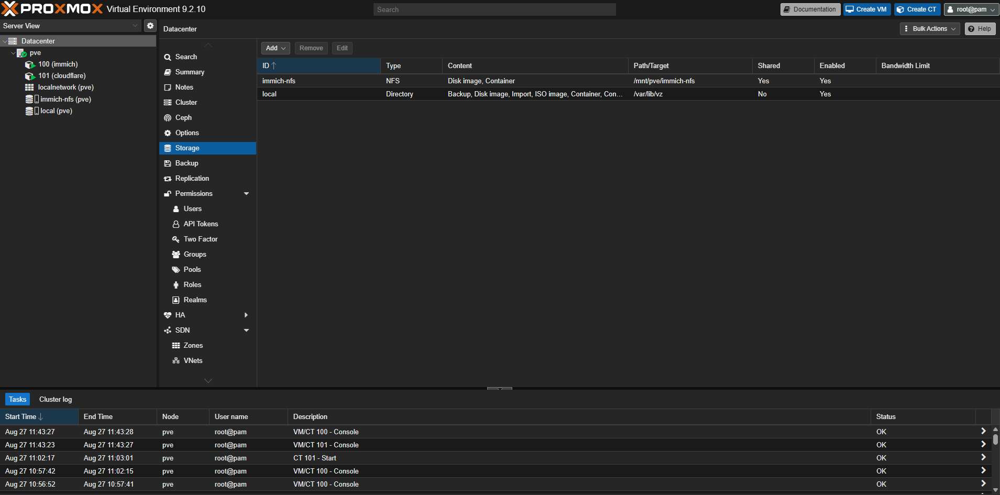

# Evidence and validation index

[Back to the portfolio](../README.md)

Evidence is grouped by what it can establish. Screenshots show an August 2026 configuration snapshot; later command results are summarized separately. They are not live monitoring.

| Evidence | What it supports | What it does not prove |
|---|---|---|
| [Proxmox dashboard](proxmox/proxmox-dashboard.png) | Proxmox VE 9.2.10; `pve`; CT100 Immich and CT101 Cloudflare running in that capture | Continued uptime, security policy, or every service's health |
| [CT100 resources](proxmox/lxc-immich-resources.png) | 6 GiB RAM; 2 GiB swap; 1 core; 28 GB local root disk; NFS bind-mount paths | Complete Docker volume configuration or database integrity |
| [CT101 resources](proxmox/llxc-coudflare-resources.png) | Separate Cloudflare container; 512 MiB RAM/swap; 1 core; 8 GB root disk | Tunnel authorization or external route availability |
| [Proxmox storage](proxmox/storage.png) | `immich-nfs` mounted at `/mnt/pve/immich-nfs`; local storage object present | Every listed content type being used or NAS data integrity |
| [Validation record](validation-record.md) | Reported Restic, SMART, ZFS, file-hash, and application checks | An exhaustive file comparison or a live audit |

## Proxmox deployment

## Immich allocation and media mount

## Separate Cloudflare container

The existing screenshot filename is retained so older links continue to work.

## Host storage configuration

No TrueNAS screenshot or raw SMART/ZFS log is currently checked in. The [storage case study](../documentation/incident-postmortems/truenas-storage-hdd.md) labels the available command results and their limits. Full troubleshooting conversations and credentials are not published.
